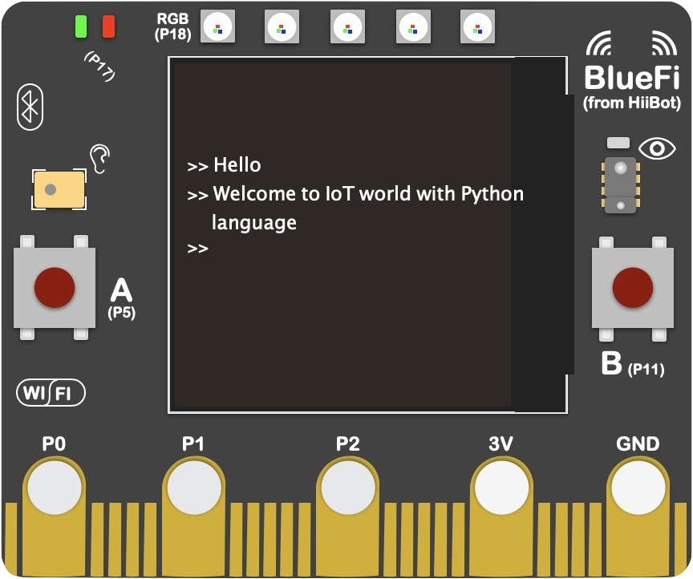
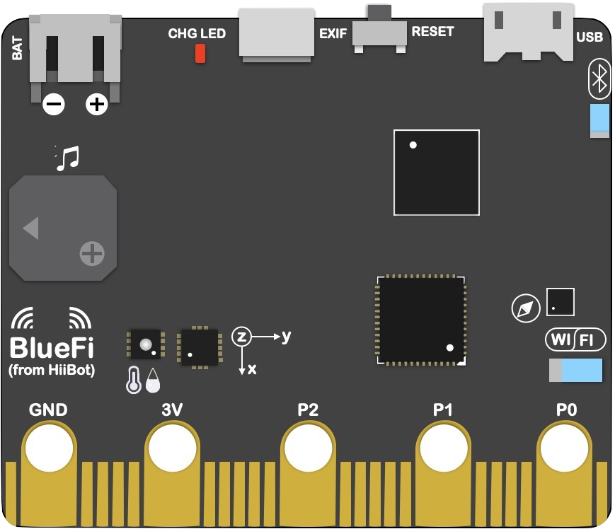

.. Python for Python4BlueFi documentation master file, created by
   sphinx-quickstart on Fri Nov 22 16:08:05 2019.
   You can adapt this file completely to your liking, but it should at least
   contain the root `toctree` directive.

BlueFi帮助文档(Python版)
===============================================

BlueFi是一种硬件接口完全兼容microbit(源自BBC)的全新单板机，采用ARM CM4F低功耗高性能计算能力CPU，
板载BlueTooth 5和WiFi无线接口，满足AI边缘计算需求。支持Scratch图形化编程语言、Python脚本编程语言，以及C/C++编程语言。采用“拖放文件即下载程序”的操作模式，
使用时不依赖任何特定软件环境。

(正面)

(背面)

-------------------------------------

BlueFi产品合作咨询请联系：400-666-8152

-------------------------------------

BlueFi简介
-------------------------------------

.. toctree::
   :maxdepth: 2
   
   bluefi_intro/index.rst

--------------------------------------

.. toctree::
   :caption: 使用BlueFi前的准备
   :maxdepth: 1
   
   bluefi_setup/index.rst

-------------------------------------

.. toctree::
    :caption: BlueFi教程
    :numbered:

    bluefi_tutorials/basics/index.rst
    bluefi_tutorials/advance/index.rst
    bluefi_tutorials/project/index.rst

-------------------------------------

.. toctree::
   :caption: 固件和开源库
   :maxdepth: 1
   
   bluefi_lib/index_firm.rst
   bluefi_lib/index_lib.rst

-------------------------------------

.. toctree::
    :caption: CPython
    :numbered:

    cpython/guide/index.rst
    cpython/essentials/index.rst
    cpython/advance/index.rst

