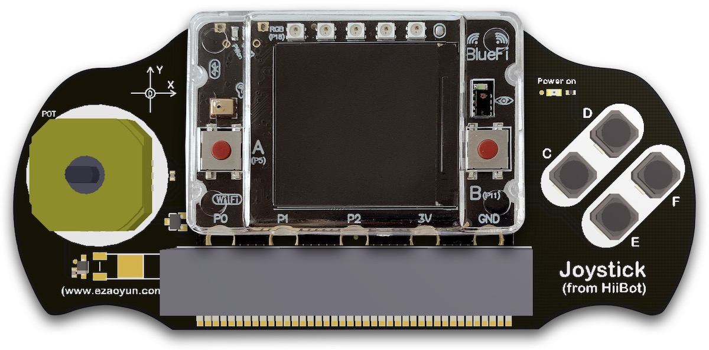
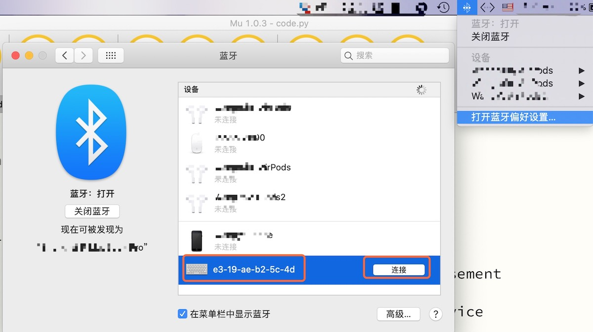

======================
Joystick手柄
======================

Joystick手柄由HiiBot推出的microbit扩展模块，包含以下资源：

  - 1x 模拟型输出的4向摇杆，使用P1(X方向)和P2(Y方向)引脚
  - 4x 轻触按钮，使用P13(C-Button)、P14(D-Button)、P15(E-Button)和P16(F-Button)引脚
  - 1x 振动马达，使用P12引脚

---------------------------------

BlueFi+Joystick组成遥控手柄，如下图所示。

与microbit+Joystick组成的遥控手柄相比，使用BlueFi丰富的传感器你将能实现更多种交互，譬如，BlueFi的姿态传感器可以手柄的姿态和手势以实现游戏互动，
使用BlueFi的声音传感器、按钮等与电脑交互，使用BlueFi的彩色像素控制氛围光，使用BlueFi的无线电通讯、蓝牙通讯和WiFi通讯实现手柄与智能小车交互等。

----------------------------------

初识Joystick手柄
----------------------------------

Joystick手柄的资源较少：4个按钮、1个摇杆和1个振动马达。我们首先试一试Joystick的基本功能。

示例代码如下：

.. code-block::  python
  :linenos:

  import time
  from hiibot_joystick import Joystick
  joy = Joystick()
  joy.Vibration = 1 # generate a little vibration (0.1s)
  time.sleep(0.1)
  joy.Vibration = 0 # turn off vibration
  x=0
  y=0
  while True:
      joy.Update()  # update state of all buttons and joystick
      if 3 < abs(x-joy.X):
          x=joy.X
          print("X:{}".format(x))
      if 3 < abs(y-joy.Y):
          y=joy.Y
          print("Y:{}".format(y))
      if joy.C_wasPressed: 
          print("C was pressed")
      if joy.D_wasPressed: 
          print("D was pressed")
      if joy.E_wasPressed: 
          print("E was pressed")
      if joy.F_wasPressed: 
          print("F was pressed")

请将上述示例代码保存到BlueFi的/CIRCUITPY/code.py文件，并将BlueFi插入到Joystick手柄上，然后使用电池或USB接口为BlueFi供电，
摇动Joystick左侧的摇杆或按压C-/D-/E-/F-按钮，观察BlueFi的LCD屏幕上显示内容的变化。

上述示例程序的前两行语句是导入Python模块，包括time和Joystick类；第3行程序是将Joystick类实例化为“joy”，第4~6行让Joystick的振动马达振动0.1秒。
本示例程序的主循环中，首先调用Joystick类的Update()接口更新按钮和摇杆的状态，然后用6个条件判断测试摇杆状态是否改变、是否有按钮被按下，
如果摇杆的任意方向变化值大于3将变化后的值输出的BlueFi屏幕上，如果任意按钮被按下则将对应按钮显示到BlueFi屏幕上。

通过这个简单的示例，我们初步了解Joystick的基本用法，包括振动马达、按钮和摇杆等，以及Joystick类的基本接口。

----------------------------------

Scratch游戏手柄
----------------------------------

众所周知，使用Scratch很容易实现各种交互小游戏，电脑键盘和鼠标是游戏交互的常用设备。BlueFi的蓝牙通讯接口支持“HID”(人机接口设备)类标准无线键盘和鼠标，
下面我们给出一个“BlueFi+Joystick”实现Scratch游戏手柄的实现示例。

示例代码如下：

.. code-block::  python
  :linenos:

  import sys
  import time
  import adafruit_ble
  from adafruit_ble.advertising import Advertisement
  from adafruit_ble.advertising.standard import ProvideServicesAdvertisement
  from adafruit_ble.services.standard.hid import HIDService
  from adafruit_ble.services.standard.device_info import DeviceInfoService
  from adafruit_hid.keyboard import Keyboard
  from adafruit_hid.keycode import Keycode
  from adafruit_hid.keyboard_layout_us import KeyboardLayoutUS
  from hiibot_bluefi.basedio import Button, NeoPixel
  from hiibot_joystick import Joystick

  button = Button()   # button.A, button.B
  pixels = NeoPixel() 
  joy = Joystick()    # joy.C, joy.D, joy.E, joy.F, joy.X(-100~100), joy.Y(-100~100)

  # Use default HID descriptor
  hid = HIDService()
  device_info = DeviceInfoService(
      software_revision=adafruit_ble.__version__, manufacturer="HiiBot"
  )
  advertisement = ProvideServicesAdvertisement(hid)
  advertisement.appearance = 961
  scan_response = Advertisement()

  ble = adafruit_ble.BLERadio()
  if ble.connected:
      for c in ble.connections:
          c.disconnect()

  print("advertising")
  ble.start_advertising(advertisement, scan_response)

  k = Keyboard(hid.devices)
  kl = KeyboardLayoutUS(k)
  while True:
      while not ble.connected:
          pass
      print("Start typing:")
      while ble.connected:
          c=''
          if button.A:
              c='a'
          if button.B:
              c='b'
          if joy.C:
              c='c'
          if joy.D:
              c='d'
          if joy.E:
              c='e'
          if joy.F:
              c='f'
          if c!='':
              #sys.stdout.write(c) # send this char to console
              kl.write(c) # send this char to BLE keyboard (Master)
              time.sleep(0.2)
      ble.start_advertising(advertisement)

请将上述示例代码保存到BlueFi的/CIRCUITPY/code.py文件，并将BlueFi插入到Joystick手柄上，然后使用电池或USB接口为BlueFi供电，
打开电脑或手机的蓝牙设置窗口，将会看到一种新的蓝牙键盘，如下图所示：

途中红色框内的键盘没有特定名称，仅以BlueFi蓝牙的MAC地址为名称。点击连接按钮即可将BlueFi_Joystick组成的遥控手柄变成一种蓝牙键盘，
该键盘与标准的USB或蓝牙HID键盘完全兼容，由于电脑允许同时接入多个HID键盘，我们的电脑现在多了一个带有6个按钮(A~F)的键盘。
现在可以修改你的Scratch游戏程序以使用A~F的某些键来交互，如下图所示：

.. image::  ../../_static/images/peripheral/joystick_scratch.gif
  :scale: 40%
  :align: center

目前绝大多数手机和平板电脑都支持外置的蓝牙接口的HID键盘，你可以参考上述步骤使用本示例程序所实现的“BlueFi+Joystick组成的蓝牙键盘”连接到自己的平板电脑上，
我们也可以实现另类的交互。请注意，不同的OS平台上本示例的“蓝牙键盘”的设备名称略有区别，但仍能使用蓝牙的MAC地址把他们与其他键盘区分开。

我们现在回来看本示例的源码。前12行代码都是导入Python模块，主要包括adafruit_ble类和adafruit_hid类及他们的子类，
以及BlueFi的basedio模块中的Button类和NeoPixel类，Joystick类；接着分别把这些类或子类实例化；在第23～30行程序以阻塞的方式启动蓝牙；
第30行程序启动蓝牙广播，此时附近的电脑或手机的蓝牙配置窗口都可以观察到“BlueFi+Joystick组成的蓝牙键盘”。

在本示例程序的主循环中，首先检测蓝牙键盘是否与附近的电脑或手机连接，如果已连接则提示“Start typing:”，然后更新BlueFi的按钮和Joystick的按钮状态，
如果检测到按钮被按下则将将被按下按钮名称的小写字母键值发送给已连接的电脑或手机；如果检测到蓝牙连接已断开，重新启动蓝牙广播并进入等待连接状态直到连接上。

----------------------------------

两个手柄之间的无线电通讯
----------------------------------

BlueFi的无线电通讯是一种最简单的无线通讯接口。本示例使用两个"BlueFi+Joystick"实现他们之间的无线电通讯，
本示例中的两个"BlueFi+Joystick"的角色分别为“信息发送者”和“信息接收者”。

“信息发送者”的示例代码如下：

.. code-block::  python
  :linenos:

  import time
  from hiibot_joystick import Joystick
  from adafruit_ble_radio import Radio
  joy = Joystick()
  rfc = Radio(channel=2) # sender and receiver must use a same channel
  joy.Vibration = True
  time.sleep(0.06)
  joy.Vibration = False
  myhead = "RF9628-"
  headX = myhead + "X:{}"
  headY = myhead + "Y:{}"
  headC = myhead + "C:{}"
  headD = myhead + "D:{}"
  headE = myhead + "E:{}"
  headF = myhead + "F:{}"
  x=0
  y=0
  while True:
      joy.Update()
      if 3 < abs(x-joy.X):
          x=joy.X
          rfc.send(headX.format(x))
          print(headX.format(x))
      if 3 < abs(y-joy.Y):
          y=joy.Y
          rfc.send(headY.format(y))
          print(headY.format(y))
      if joy.C_wasPressed: 
          rfc.send(headC.format(0))
      if joy.C_wasReleased: 
          rfc.send(headC.format(1))
      if joy.C_pressedFor(2): 
          rfc.send(headC.format(2))
      if joy.D_wasPressed: 
          rfc.send(headD.format(0))
      if joy.D_wasReleased: 
          rfc.send(headD.format(1))
      if joy.D_pressedFor(2): 
          rfc.send(headD.format(2))
      if joy.E_wasPressed: 
          rfc.send(headE.format(0))
      if joy.E_wasReleased: 
          rfc.send(headE.format(1))
      if joy.E_pressedFor(2): 
          rfc.send(headE.format(2))
      if joy.F_wasPressed: 
          rfc.send(headF.format(0))
      if joy.F_wasReleased: 
          rfc.send(headF.format(1))
      if joy.F_pressedFor(2): 
          rfc.send(headF.format(2))

“信息接收者”的示例代码如下：

.. code-block::  python
  :linenos:

  import time
  from hiibot_bluefi.basedio import NeoPixel
  from adafruit_ble_radio import Radio
  pixels = NeoPixel()
  rfc = Radio(channel=2) # sender and receiver must use a same channel
  pixels.brightness = 0.2
  myhead = "RF9628-"
  while True:
      rmsg = rfc.receive_full()
      if rmsg:
          pixels.pixels[0]=(0,255,0)
          pixels.pixels.show()
          rmsg_bytes = rmsg[0]
          rmsg_strength = rmsg[1]
          rmsg_time = rmsg[2]
          print("Recieved {} (strength {}, at time {})".format(
                rmsg_bytes, rmsg_strength, rmsg_time))
          # resolve the messages and do something to ack in here, do sth in here
          pixels.pixels[0]=(0,0,0)
          pixels.pixels.show()
      pass

对比两个示例代码，虽然“信息发送者”代码更长，但逻辑上更好理解：更新Joystick上的4个按钮状态和摇杆状态，如果状态发生变化则将当前状态发送出去。
“信息接收者”的代码主要检测是否已收到消息，如果已收到则解析消息，同时让BlueFi上的5颗彩灯亮起来，档信息解析完毕则关闭所有彩灯。

两个示例程序中最关键的地方，两者的第5行语句中Radio类实例化时的传入参数“channel=2”。你可以试着采用不同的“channel”值，再测试信息发送和接收，
并观察结果。总之，无线电通讯必需在一个频道内，即Radio类实例化时的传入参数“channel“值必需相同，否则无法实现无线电通讯。
如果把"channel"参数看作是无线电的工作频率，我们就不难理解为什么需要确保信息收发的双方使用相同的“channel”参数。

如果“信息接收者”是一个小车，譬如RunGo+BlueFi组成的小车，“信息发送者”的手柄就变成“无线电遥控器”的角色，请你来试着修改“信息接收者”的示例程序，
实现“当A按钮按下时小车开始低速前行”、“当C按钮按下时小车开始加速，当C按钮释放时停止加速并保持该速度前进”、“当E按钮按下时小车开始减速，
当E按钮释放时停止减速并保持该速度前进”、“当D按钮按下时小车开始向左转，当D按钮释放时停止左转并保持当前方向和速度前进”、..等遥控小车的逻辑功能。
然后对“信息发送者”程序稍作修改即可实现小车的无线电遥控器功能。

除了遥控小车、遥控手柄之外，使用蓝牙、无线电等通讯接口，你还有哪些创意？

--------------------------------

.. admonition::  遥控手柄(Joystick)接口库总结：

  - 导入Joystick库：from  hiibot_joystick import Joystick
  - 实例化手柄：joy = Joystick()
  - 使用Joystick的按钮输入接口：

    - 更新Joystick的4个按钮状态：joy.Update() 
      
    - C按钮的状态属性值：cs = joy.C

      - True/1，表示C按钮是按下的状态
      - False/0，表示C按钮是释放的状态

    - C按钮是否已被按下：cs = joy.C_wasPressed

      - True/1，表示已按下
      - False/0，表示未按下
    
    - C按钮是否已被释放：cs = joy.C_wasReleased

      - True/1，表示已释放
      - False/0，表示未释放

    - C按钮是否已被长按且超过指定的时间ts：cs = joy.C_pressedFor(ts)

      - True/1，表示已按下且超过指定的ts时间(单位为秒)
      - False/0，表示未被长按且超过指定的ts时间
  
    -D按钮状态及其接口，同上(仅字母"C"变为字母"D")

    -E按钮状态及其接口，同上

    -F按钮状态及其接口，同上

  - 使用Joystick的摇杆输入接口：

    - X方向摇杆状态的属性值(只读的)： xv=joy.X，有效值范围：-100(向右推)~0～100(向左推)
    - Y方向摇杆状态的属性值(只读的)： xv=joy.Y，有效值范围：-100(向下推)~0～100(向上推)

  - Joystick上的振动马达控制接口：

    - 振动马达的状态值属性(可读可写的)： joy.Vibration = not joy.Vibration，有效值：1(或True)，开始振动；0(或False)，停止振动

