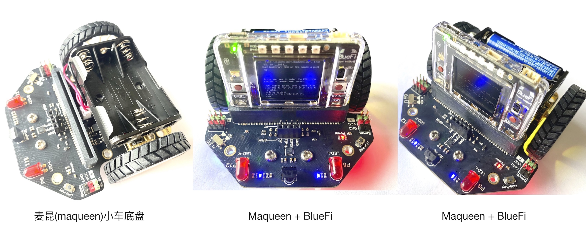
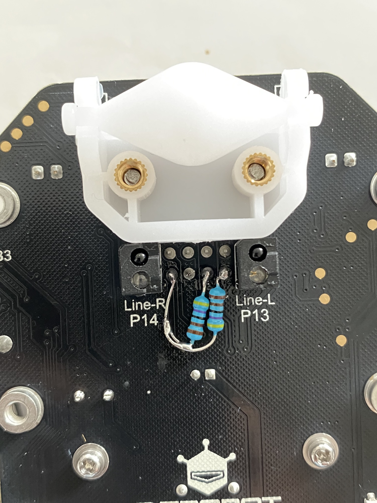
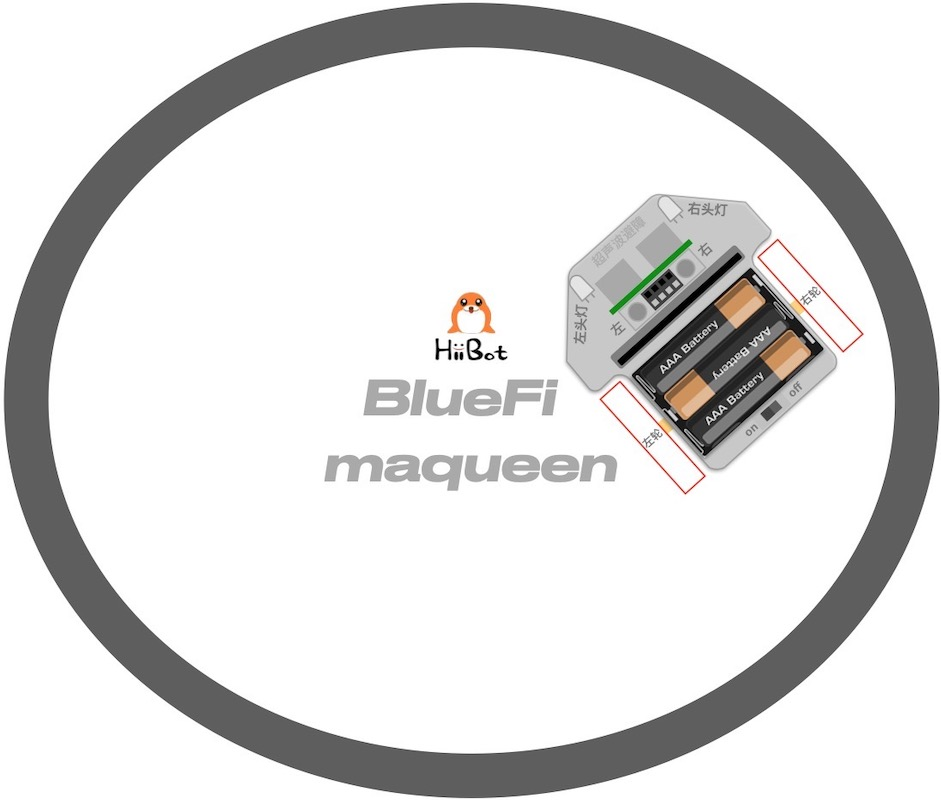
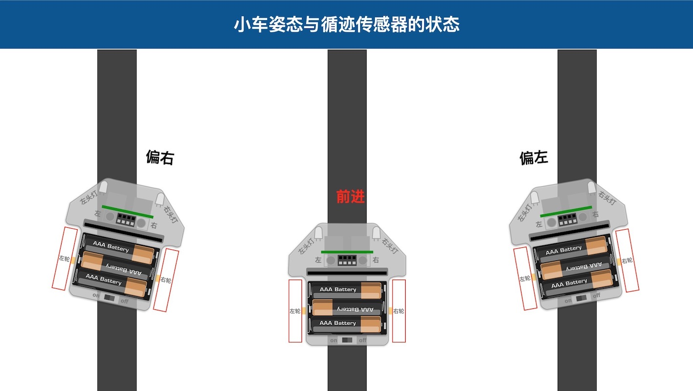
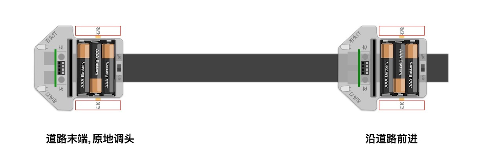
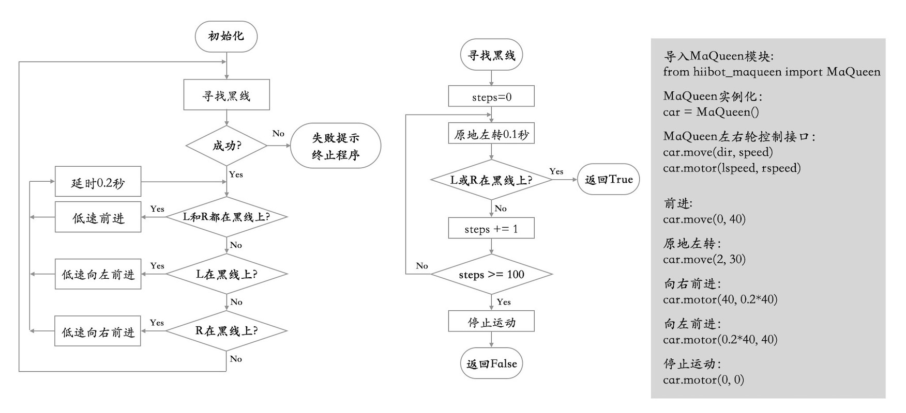
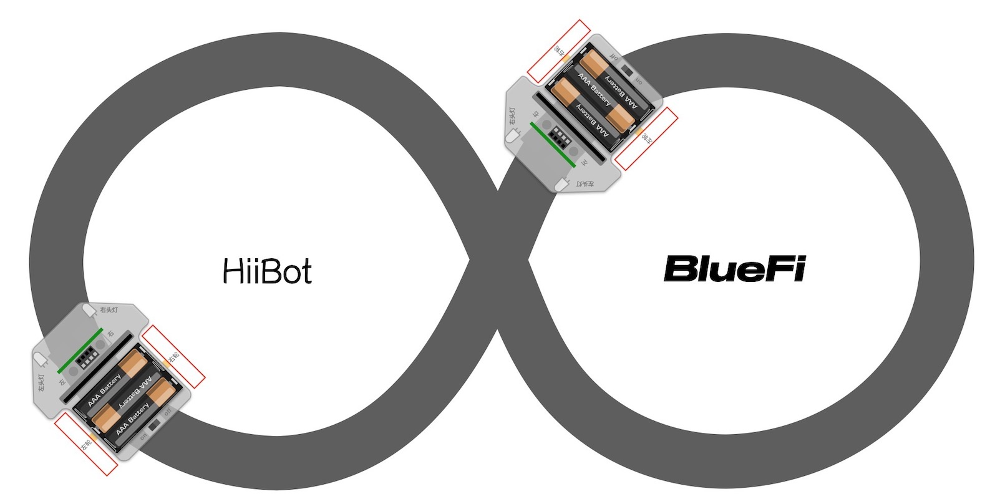
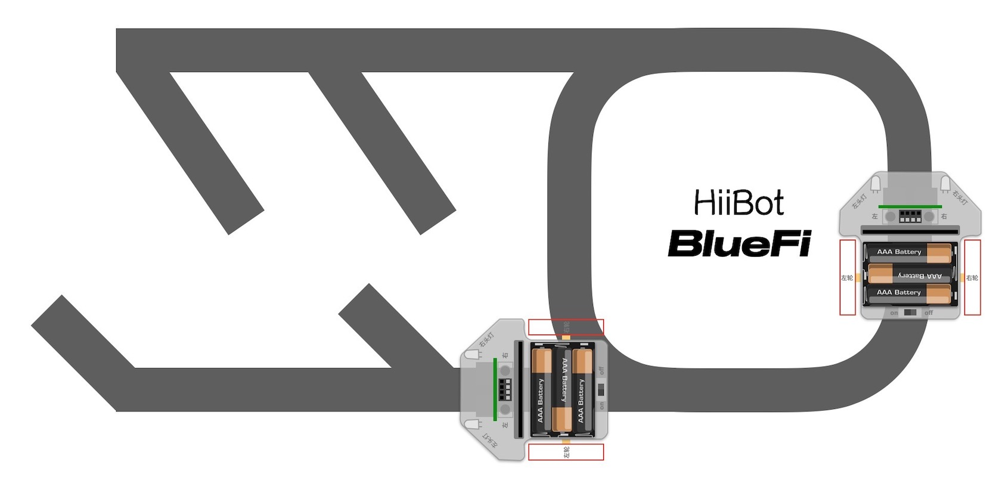
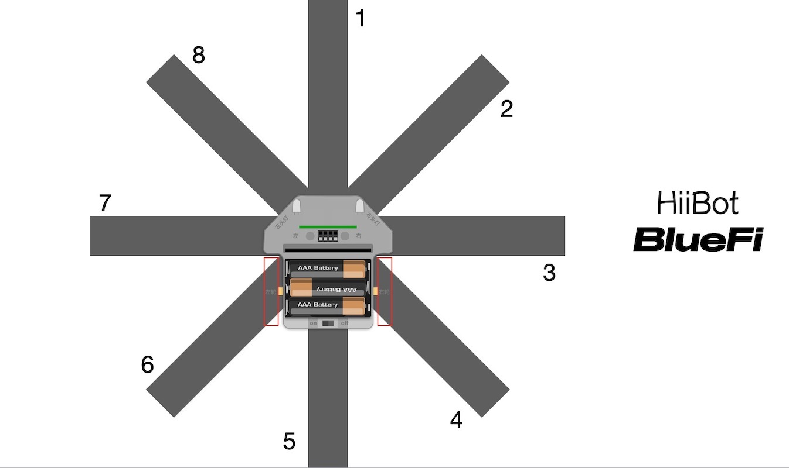

======================
麦昆小车(Maqueen)
======================

麦昆小车(Maqueen)由DFRobot推出的智能小车底盘，属于microbit周边的小车底盘类，包含以下资源：

  - 1x 超声波避障传感器，使用P1(Trig)和P2(Echo)
  - 2x 光电反射型循迹传感器，使用P13(leftTrackSensor)和P14(rightTrackSensor)
  - 2x 红色LED头灯，使用P8(leftHeadLED)和P8(rightHeadLED)
  - 4x 底盘像素彩灯(兼容WS2812B)，使用P15
  - 2x 直流有刷电机(N20型)，使用IIC接口(IIC从地址：0x10)，左电机控制(寄存器地址为0)，右电机控制(寄存器地址为2)
  - 2x 舵机控制接口，S1(寄存器地址为20)和S2(寄存器地址为21)
  - 1x 红外遥控器输入(BlueFi暂不支持红外遥控接收)

---------------------------------

BlueFi+MaQueen组成智能小车，如下图所示。

与microbit+MaQueen组成的智能小车相比，使用BlueFi丰富的传感器你将能实现更多种交互。

--------------------------------

使用前准备工作
-------------------------------

使用麦昆小车前，需要先准备3节1.5V的7号电池，且确保电池电量饱满，将电池正确地放入电池盒。
此外，请按照下图为I2C(或IIC)增加上拉电阻。电阻值可选择2.2K/4.7K/5.1K，并使用烙铁和焊锡丝等工具将两个电阻焊接在如图位置。

为什么需要增加这两个电阻呢？首先我们需要知道I2C接口的两个信号线要求必须有上拉电阻。麦昆小车的电机、舵机控制使用I2C接口与BlueFi的P19和P20
引脚连接，然而BlueFi的P19和P20引脚没有板载上拉电阻，麦昆小车的板上的这两个引脚也没有上拉电阻，这样不能满足I2C总线的“线与”要求。

这个需求只针对部分BlueFi。当你执行下面的示例任意程序时，如果在BlueFi的LCD屏幕上或串口控制台上看到以下的错误提示时，说明需要增加这两个上拉电阻。

.. code-block::  
  :linenos:

  code.py output:
  Traceback (most recent call last):
    File "code.py", line 3, in <module>
    File "/lib/hiibot_maqueen.py", line 92, in __init__
  RuntimeError: SDA or SCL needs a pull up

为避免硬件错误造成的程序异常，BlueFi的I2C接口程序库在初始化I2C接口设备时会自动侦测硬件连接，如果不满足要求的硬件将会触发错误提示。

当然，如果你未将BlueFi插入到麦昆小车上，却让BlueFi运行控制麦昆小车的程序也会触发这一错误提示！

--------------------------------

让麦昆动起来
--------------------------------

准备工作做好之后，我们首先让麦昆小车动起来。实现的效果：小车前进一段距离；然后开启右转灯并开始右转，然后关闭右转灯并停止右转；然后再后退
一段距离；再开启左转灯左转，最后关闭左转灯并停止左转；如此循环。

示例程序代码如下：

.. code-block::  python
  :linenos:

  import time
  from hiibot_maqueen import MaQueen
  car = MaQueen()
  carspeed = 50
  while True:
      car.motor(carspeed, carspeed)
      time.sleep(1.5)
      car.stop()
      car.rightHeadLED = 1   # turn on right head lamp
      car.motor(carspeed//2, -carspeed//2)
      time.sleep(1.5)
      car.rightHeadLED = 0   # turn off right head lamp
      car.stop()
      car.motor(-carspeed, -carspeed)
      time.sleep(1.5)
      car.stop()
      car.leftHeadLED = 1    # turn on left head lamp
      car.motor(-carspeed//2, carspeed//2)
      time.sleep(1.5)
      car.leftHeadLED = 0    # turn off left head lamp
      car.stop()

请将上述示例代码保存到BlueFi的/CIRCUITPY/code.py文件，并将BlueFi插入到麦昆小车上，然后打开麦昆小车的电源开关，
请观察麦昆小车的动作是否达到我们的预期效果。

上述示例程序非常容易理解。前两行语句是导入Python模块，第3行程序是将MaQueen类实例化为“car”，第4行设置一个常数。
在无穷循环程序块中，我们使用“car.motor(左轮速度和方向, 右轮速度和方向)”接口控制小车前进、后退、左转和右转，该接口的
两个参数分别代表左轮速度和方向、右轮速度和方向，负数表示反转，正数表示正转，数值绝对值的大小代表速度，速度取值0～255。

此外，本示例也展示如何控制麦昆小车的左/右头灯。

--------------------------------

电子围栏
-------------------------------

前一个示例没有任何逻辑，只是简单的顺序执行固定动作，下面我们来实现一个稍微复杂一点的动作效果：地上画个圆作为电子围栏的边界，
麦昆小车就在围栏内随意行驶。准备工作：在白色地面或纸上贴上宽度大于1公分以上的黑色胶带或不干胶，确保黑色胶带围成一个封闭的图案，
并将麦昆小车放在图案内。图案可以参考下图所示：

执行下面的示例代码，你会看到麦昆小车在电子围栏内随意地行驶，但始终不会跑出围栏。

.. code-block::  python
  :linenos:

  import time
  from hiibot_maqueen import MaQueen
  from hiibot_bluefi.basedio import Button, NeoPixel
  button = Button()
  pixels = NeoPixel()
  car = MaQueen()
  print("testing MaQueen (from DFRobot)")
  car.stop() # stop motors
  carrun = False

  car.servo(0, 90) # set Servo_0 as 90
  car.servo(1, 30) # set Servo_1 as 30

  car.pixels.brightness = 0.1
  car.pixels.fill((0,0,0)) # two pixels on the bottom set to RED
  car.pixels.show()
  colors = [(255,0,0), (255,255,0), (0,255,0), (0,0,255)]
  st = time.monotonic()

  def roundColors():
      global st
      if (time.monotonic() - st) < (0.2 if carrun==True else 0.6):
          return
      st = time.monotonic()
      t=colors[0]
      for ci in range(3):
          colors[ci] = colors[ci+1]
          car.pixels[ci] = colors[ci]
      colors[3] = t
      car.pixels[3] = colors[3]
      car.pixels.show()

  while True:
      roundColors()
      button.Update()
      if button.A_wasPressed:
          carrun = True
          print("running")
      if button.B_wasPressed:
          car.stop()
          print("stop")
          carrun = False
      ls = car.leftTrackSensor
      rs = car.rightTrackSensor
      if carrun:
          if ls ==0 and rs ==0 :
              car.stop()
              car.move(1,-40)  # backward
              time.sleep(0.2)
              car.stop()
              car.leftHeadLED = 1
              car.move(2, 60)  # turn left
              time.sleep(0.2)
              car.leftHeadLED = 0
              car.stop()
          elif ls ==0 :
              car.stop()
              car.rightHeadLED = 1
              car.move(3, 60)  # turn right
              time.sleep(0.2)
              car.rightHeadLED = 0
              car.stop()
          elif rs ==0 :
              car.stop()
              car.leftHeadLED = 1
              car.move(2, 60)  # turn left
              time.sleep(0.2)
              car.leftHeadLED = 0
              car.stop()
          else:
              car.move(0, 60)  # forward
              time.sleep(0.02)
      pass

将示例程序保存到BlueFi的/CIRCUITPY/code.py文件中，并将BlueFi插入到麦昆小车，将麦昆小车的电源开关拨到
“on”档位，等待我们的程序正式开始运行后，按下BlueFi的A按钮，并将整个小车放在黑色胶带围成的封闭图案内，
你将看到麦昆小车始终在围栏内行驶。当你想要让麦昆小车停下时，请按下BlueFi的B按钮即可，或者直接关闭电源。

为什么麦昆小车不会越过黑色胶带围成的“围栏边界”呢？我们使用麦昆小车底部的一对循迹传感器来侦测小车是否到达
“围栏边界”，如果遇到边界则根据这对传感器的状态来调整行驶方向：如果两个传感器都侦测到黑色边界，则先后退一段距离
再左转；如果只有左侧传感器侦测到黑色边界则右转；如果右侧传感器侦测到黑色边界则左转；如果传感器都未侦测到黑色边界
则继续前进。

这是本示例程序的无穷循环程序块中的关键逻辑，或者说这就是实现“电子围栏”效果的关键逻辑。本示例中增加2个按钮做交互
实现开始行驶和停止行驶的功能，也属于无穷循环程序块的一部分逻辑。

为了达到更好的视觉效果，本示例程序使用麦昆小车底盘的4颗彩灯来指示行驶、停车状态：在围栏内行驶期间4颗彩灯的颜色
不断地转动；当停车时彩灯颜色几乎全部保持白色。

你可以根据本向导底部的接口库介绍来掌握麦昆小车的控制接口，然后设计更加有趣的示例。

--------------------------------

循迹小车
-------------------------------

AGV(Automatic Guided Vehicle，无人搬运车)小车已经是很多现代车间里最重要的物料“搬运工”！沿着预先规划好的
路线能够无人且自动驾驶的货车能够将仓库的物料自动地运送到指定工位，并从指定工位将产品自动运送会成品仓库。这些曾
经依靠人力或依靠司机开着货车来完成的工作，现在逐步被AGV代替。

AGV如何实现“沿着规定路线行驶到指定停靠点”呢？有很多种方法可以实现AGV的功能，本向导给出一种循迹的方法。使用循迹
传感器反馈的状态信号控制麦昆小车运动来模拟AGV。

我们仍以地面贴黑色胶带或不干胶来“指定路线”，编程控制麦昆小车沿着该路线行驶(允许弯曲的路线)，到达路线末端后自动
调头并原路返回。为了更好地理解循迹的程序逻辑，我们先分析下图的三种情况：

根据上图所示，如果小车向右偏离路线我们应该如何纠偏呢？向左偏离时又如何纠偏呢？如下图，当我们达到道路末端时，循迹
传感器的状态是怎样？如何让麦昆小车绕自身中心调头呢？

当我们简单地分析这几种特殊情况之后，有助于掌握下面的示例程序中的关键逻辑和代码。本示例的准备工作非常简单，请使用
前示例所用的黑色胶带围成的封闭边界作为本次循迹的“指定路线”。

.. code-block::  python
  :linenos:

  import time
  import random
  from hiibot_bluefi.basedio import Button, NeoPixel
  from hiibot_maqueen import MaQueen
  car = MaQueen()
  button = Button()
  pixels = NeoPixel()

  #  stop car one second
  car.stop()
  carspeed = 75
  time.sleep(1)
  start = True

  car.pixels.fill((0,0,0))
  car.pixels.show()
  colors = [(255,0,0), (255,255,0), (0,255,0), (0,0,255)]
  st = time.monotonic()

  def roundColors():
      global st
      if (time.monotonic() - st) < (0.2 if start==True else 0.6):
          return
      st = time.monotonic()
      t=colors[0]
      for ci in range(3):
          colors[ci] = colors[ci+1]
          car.pixels[ci] = colors[ci]
      colors[3] = t
      car.pixels[3] = colors[3]
      car.pixels.show()

  def  searchBackLine():
      global car
      for steps in range(360):
          rdir = random.randint(0, 2)
          if rdir==0:
              car.move(2, carspeed)
          else:
              car.move(3, carspeed)
          time.sleep(0.005)
          if not car.rightTrackSensor or not car.leftTrackSensor:
              # backlin be searched by any sensor
              car.stop()
              return True
      car.stop()
      return False

  def ssButton():
      global start
      button.Update()
      if start and button.B_wasPressed:
          print("stop")
          start = False
          return 2  # stop
      if not start and button.A_wasPressed:
          print("start")
          start = True
          return 1  # start
      return 0      # hold the current status
      

  while True:
      ssButton()
      sbl = searchBackLine()
      if sbl and start:
          print("start to track this backline")
          while True:
              ssButton()
              if not start:
                  car.stop()
                  time.sleep(0.1)
                  continue
              # two sensors is above backline, go on
              if not car.rightTrackSensor and not car.leftTrackSensor:
                  car.motor(carspeed, carspeed)
              # left sensor is above backline, but right sensor missed backline, thus turn left
              elif not car.leftTrackSensor:
                  car.motor(carspeed//3, carspeed)
              # right sensor is above backline, but left sensor missed backline, thus turn right
              elif not car.rightTrackSensor:
                  car.motor(carspeed, carspeed//3)
              # two sensors missed backline, thus stop car and search backline
              else:
                  car.stop()
                  print("black line is missing, need to search the black line")
                  break
              time.sleep(0.01)
              roundColors()
      else:
          print("failed to search backline")
          while True:
              pass

看起来程序代码很长！为了帮助你理解程序语句的作用，请分析下面的流程图，并对照程序代码、执行程序时麦昆的行为。

将示例程序保存到BlueFi的/CIRCUITPY/code.py文件中，并将BlueFi插入到麦昆小车，将麦昆小车的电源开关拨到
“on”档位，并将整个小车放在黑色胶带上方，等待我们的程序正式开始运行后，观察程序的执行效果。
如果你想要让麦昆小车停下来，按下B按钮即可。

虽然示例程序看起来很长，我们增加的彩光效果和按钮控制开启/停车等逻辑占用将近一半的代码，真正的循迹控制逻辑
只是在嵌套循环的内循环体中。

此外，本示例程序中包含一个容错处理，被定义成子程序searchBackLine。该子程序可以实现：当麦昆小车的两个循迹传感器
都未检测到“指定路线”的黑色道路时，小车将自动开始绕自身中心旋转，找到黑色道路后再继续沿路行驶。

你也可以试一试如下图所示的“指定路线”，你能预测自己的麦昆小车会如何行驶？

事实上，企业车间的仓库分为原料仓库、半成品仓库、成品仓库等多种，生产工位较多，如何实现多点物料搬运？需要我们去探索，
下面的几张图是多点物料搬运问题的抽象图例，你可以使用黑色胶带或不干胶绘制这些图中的“指定路线”，编程实现沿着这些“指定
路线”自动搬运物料的小车。

--------------------------------

AGV避障
--------------------------------

如果AGV行驶过程中遇到障碍物怎么办？譬如有人正好站在AGV行驶路线上，此时AGV绝对不能直接撞上去。问题是，AGV
如何知道前方有人？麦昆小车带有一个超声波传感器，能够检测2公分到4米距离内的障碍物。下面我们修改前一个示例实现
这一功能：当麦昆小车的行驶方向有障碍物时，让麦昆小车自动停下来，直到障碍物被移除。

示例程序代码如下：

.. code-block::  python
  :linenos:

  import time
  import random
  from hiibot_bluefi.basedio import Button, NeoPixel
  from hiibot_maqueen import MaQueen
  car = MaQueen()
  button = Button()
  pixels = NeoPixel()

  #  stop car one second
  car.stop()
  carspeed = 75
  time.sleep(1)
  start = True

  car.pixels.fill((0,0,0))
  car.pixels.show()
  colors = [(255,0,0), (255,255,0), (0,255,0), (0,0,255)]
  st = time.monotonic()

  def roundColors():
      global st
      if (time.monotonic() - st) < (0.2 if start==True else 0.6):
          return
      st = time.monotonic()
      t=colors[0]
      for ci in range(3):
          colors[ci] = colors[ci+1]
          car.pixels[ci] = colors[ci]
      colors[3] = t
      car.pixels[3] = colors[3]
      car.pixels.show()

  def  searchBackLine():
      global car
      for steps in range(360):
          rdir = random.randint(0, 2)
          if rdir==0:
              car.move(2, carspeed)
          else:
              car.move(3, carspeed)
          time.sleep(0.005)
          if not car.rightTrackSensor or not car.leftTrackSensor:
              # backlin be searched by any sensor
              car.stop()
              return True
      car.stop()
      return False

  def ssButton():
      global start
      button.Update()
      if start and button.B_wasPressed:
          print("stop")
          start = False
          return 2  # stop
      if not start and button.A_wasPressed:
          print("start")
          start = True
          return 1  # start
      return 0      # hold the current status
      

  while True:
      ssButton()
      sbl = searchBackLine()
      if sbl and start:
          print("start to track this backline")
          while True:
              ssButton()
              dist_cm = car.distance
              if not start or dist_cm<15:
                  car.stop()
                  time.sleep(0.1)
                  continue
              # two sensors is above backline, go on
              if not car.rightTrackSensor and not car.leftTrackSensor:
                  car.motor(carspeed, carspeed)
              # left sensor is above backline, but right sensor missed backline, thus turn left
              elif not car.leftTrackSensor:
                  car.motor(carspeed//3, carspeed)
              # right sensor is above backline, but left sensor missed backline, thus turn right
              elif not car.rightTrackSensor:
                  car.motor(carspeed, carspeed//3)
              # two sensors missed backline, thus stop car and search backline
              else:
                  car.stop()
                  print("black line is missing, need to search the black line")
                  break
              time.sleep(0.01)
              roundColors()
      else:
          print("failed to search backline")
          while True:
              pass

如果你细心地对比以下上面的代码与前一个示例的代码，你会发现为了让正在行驶AGV不会直接撞上自己前方突然出现的障碍物，
我们只是修改修改了第70行和第71行程序，第70行语句是将麦昆小车的超声波测距传感器的“麦昆与前方障碍物之间距离”赋予
变量“dist_cm”，然后把第71行原来的“判断是否按下停车按钮”的单逻辑修改为“或组合”逻辑：“按下停车按钮”或“与障碍物
之间距离小于15(cm)”，如果这个“或组合”逻辑的结果为“True”，让麦昆停车，并跳过无穷循环的后续程序块。

根据前一个示例的使用效果，按下按钮B立即停车，按下按钮A则继续行驶。本示例修改后的“或组合”逻辑实现的效果：按钮B按钮
或与前方障碍物的距离小于15公分时立即停车。那么停车期间按下按钮A会是什么样的效果呢？

将示例程序保存到BlueFi的/CIRCUITPY/code.py文件中，并将BlueFi插入到麦昆小车，将麦昆小车的电源开关拨到
“on”档位，并将整个小车放在黑色胶带上方，等待我们的程序正式开始运行后，用你的手掌放在麦昆行驶路线前方来模拟障碍物，
观察麦昆的反应。

--------------------------------

走出巨石阵(避障)
--------------------------------

下面来个更简单一点的效果。麦昆不慎进入一个巨石阵(很多个一次性杯子随机摆放在地上来模拟此阵)内，编程帮助麦昆走出
巨石阵，切勿让麦昆碰到巨石。

根据这一个任务，我们可以想象麦昆的行为或许应该是，与障碍物的距离小于10公分时，随机地选择右转或左转，直到前方的
障碍物距离大于100公分(即1米)则停止转动，继续前进。虽然我们事先并不直到巨石阵中障碍物的具体位置，采用随机搜索可行
路径的方法或许能够帮助麦昆走出巨石阵。

示例程序如下：

--------------------------------

让麦昆配合你扮演气功大师
--------------------------------

武林高手能隔山打牛，气功大师能用气击退敌人。让麦昆当个“托儿”帮助我们表演气功大师的绝招。

--------------------------------

麦昆闻声而动
--------------------------------

灭霸想打个响指想让宇宙半数生命灰飞烟灭，我想打个响指让麦昆前进几步。BlueFi的声音传感器能“听”到响指声，进而
控制麦昆小车前进，我们如此可以实现用声音交互的智能小车。随着你的深入学习，或许有一天你还可以编程实现：对着麦昆
喊“走你”，小车就开始前进，再喊“停”，小车就自动停车。虽然BlueFi支持机器学习能够对你说的短语进行分类，并实现
相应的动作，本向导仅仅实现侦测到“很大的声音”并作出相应的简单逻辑。

--------------------------------

麦昆随光行动
--------------------------------

BlueFi的正面带有一个集成光传感器

--------------------------------

.. admonition::  麦昆(MaQueen)接口库总结：

  - 导入麦昆小车库：from  hiibot_maqueen import MaQueen
  - 实例化麦昆小车：car = MaQueen()
  - 使用麦昆小车的传感器：

    - “超声波避障/测距”传感器当前的障碍物距离：dist = car.distance 

      - 有效值为2~4000mm，超出此范围都属于异常
      
    - “左循迹”传感器的状态：ls = car.leftTrackSensor

      - True/1，表示有反射信号
      - False/0，表示无反射信号

    - “右循迹”传感器的状态：ls = car.rightTrackSensor

      - True/1，表示有反射信号
      - False/0，表示无反射信号
    
  - 麦昆小车的输出控制类：

    - “左头灯”亮： car.leftHeadLED = 1
    - “左头灯”灭： car.leftHeadLED = 0
    - “右头灯”亮： car.rightHeadLED = 1
    - “右头灯”灭： car.rightHeadLED = 0
    - “底盘彩灯”控制： car.pixels[i] = (255,0,0), car.pixels.show()。详细方法请参考NeoPixel类的用法
    - “舵机”控制，舵机S1转到90度： car.servo(0, 90) 
    - “舵机”控制，舵机S2转到120度： car.servo(1, 120) 
    - “小车双电机”控制，小车以50的速度前进： car.motor(50, 50)
    - “小车双电机”控制，小车以80的速度后退： car.motor(-80, -80)
    - “小车双电机”控制，小车以40的速度绕自身中心左转(原地左转)： car.motor(-40, 40)
    - “小车双电机”控制，小车以100的速度绕自身中心右转(原地右转)： car.motor(100, -100)
    - “小车双电机”控制，小车以60的速度绕右轮左转： car.motor(60, 0)
    - “小车双电机”控制，小车以60的速度绕右轮右转： car.motor(-60, 0)

