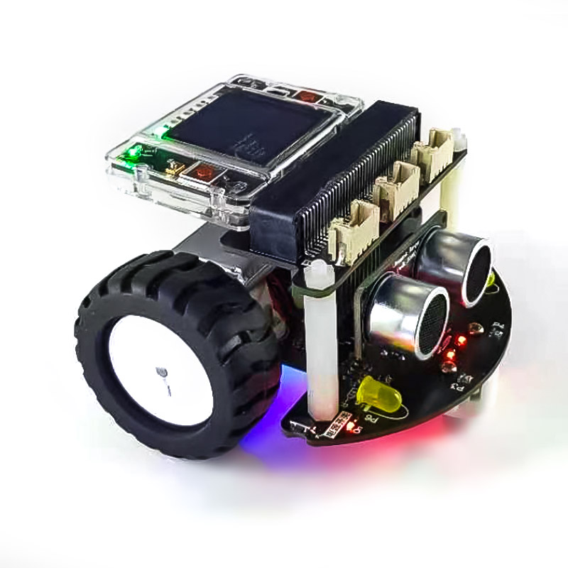

======================
跑酷小车(RunGo)
======================

跑酷小车(RunGo)由HiiBot推出的智能小车底盘，包含以下资源：

  - 3x 底盘像素彩灯(位于小车底盘的底部/面向地面, pixels)，使用P1引脚
  - 1x 颜色识别传感器(位于小车底盘的底部，识别地面上色块的颜色, groundColor)，使用P2引脚
  - 2x 光线强度传感器(位于小车前部)，使用P3(小车右前部光强度, rightLightSensor)和P4(小车左前部光强度, leftLightSensor)引脚
  - 2x 黄色头灯(位于小车前部)，使用P6(小车右前灯, rightHeadLED)和P7(小车左前灯, leftHeadLED)引脚
  - 1x 超声波避障传感器(与前方障碍物之间的距离, distance)，使用P8(Trig)和P12(Echo)引脚
  - 2x 光电反射型循迹传感器，使用P9(rightTracker)和P10(leftTracker)引脚
  - 2x 直流有刷电机(N20型)，使用P13和P15(右马达)、P14和P16(左马达)引脚
  - 1x 车载600mAh的单节锂电池及其充电和电量指示单元，使用USB Type C接口实现快速充电(20~30分钟即可充满)，满电后可连续使用1小时以上
  - 1x 高效的车载电源管理单元，小车底盘右前方的轻触按钮可开启/关闭小车电源，

---------------------------------

BlueFi+RunGo组成智能小车，如下图所示。

与microbit+RunGo组成的智能小车相比，使用BlueFi丰富的传感器你将能实现更多种交互，譬如，BlueFi的姿态传感器可以感知小车的水平或倾角，
使用BlueFi的声音传感器、按钮等与小车交互，使用BlueFi的彩色像素控制氛围光，使用BlueFi的无线电通讯、蓝牙通讯和WiFi通讯实现RunGo与手柄交互等。

----------------------------------

使用前准备工作：添加RunGo库模块
----------------------------------

使用RunGo小车前，请下载RunGo的Python库文件 :download:`hiibot_rungo.py </../../_static/lib_py/hiibot_rungo.py>` ，
将该文件保存到BlueFi的"/CIRCUITPY/lib/"文件夹中。注意，请使用USB数据线将BlueFi与你的电脑连接在一起，电脑的资源管理器中出现“CIRCUITPY”磁盘，
然后将RunGo的Python库文件复制到"/CIRCUITPY/lib/"文件夹即可。

--------------------------------

让RunGo动起来
--------------------------------

当你拿到RunGo和
准备工作做好之后，我们首先让RunGo小车动起来。实现的效果：小车前进一段距离；然后开启右转灯并开始右转，然后关闭右转灯并停止右转；然后再后退
一段距离；再开启左转灯左转，最后关闭左转灯并停止左转；如此循环。

示例程序代码如下：

.. code-block::  python
  :linenos:

  import time
  from hiibot_rungo import RunGo
  car = RunGo()
  carspeed = 80
  while True:
      car.motor(carspeed, carspeed)
      time.sleep(1.5)
      car.stop()
      car.rightHeadLED = 1   # turn on right head lamp
      car.motor(carspeed//2, -carspeed//2)
      time.sleep(1.5)
      car.rightHeadLED = 0   # turn off right head lamp
      car.stop()
      car.motor(-carspeed, -carspeed)
      time.sleep(1.5)
      car.stop()
      car.leftHeadLED = 1    # turn on left head lamp
      car.motor(-carspeed//2, carspeed//2)
      time.sleep(1.5)
      car.leftHeadLED = 0    # turn off left head lamp
      car.stop()

请将上述示例代码保存到BlueFi的/CIRCUITPY/code.py文件，并将BlueFi插入到RunGo小车上，然后打开RunGo小车的电源，
请观察RunGo小车的动作是否达到我们的预期效果。

上述示例程序非常容易理解。前两行语句是导入Python模块，第3行程序是将RunGo类实例化为“car”，第4行设置一个常数。
在无穷循环程序块中，我们使用“car.motor(左轮速度和方向, 右轮速度和方向)”接口控制小车前进、后退、左转和右转，该接口的
两个参数分别代表左轮速度和方向、右轮速度和方向，负数表示反转，正数表示正转，数值绝对值的大小代表速度，速度取值0～255。

此外，本示例也展示如何控制RunGo小车的左/右头灯。

------------------------------------

.. Important::
  **RunGo类的小车底盘接口**

    - car (自定义的RunGo类实例化对象)：

      - car = RunGo() # "car"可以自定义为其他名称

    - pixels (底盘像素彩灯子类，默认3颗RGB(兼容WS2812B)/50%亮度/GRB模式)支持的接口方法和属性包括：

      - car.pixels.fill( (R,G,B) ): 填充全部像素为设定颜色
      - car.pixels.show(): 刷新全部像素
      - car.pixels.brightness: 全部像素的亮度属性值(可读可写的)，属性值范围：0.0(灭)~1.0(最亮)
      - car.pixels[index]: 指定某个像素的颜色属性(可读可写的), index有效值范围：0~2；属性值为(R, G, B)

    - groundColor (地面颜色传感器)支持的接口方法和属性包括：

      - car.groundColorID: 地面颜色ID属性值(只读的)，地面颜色ID属性值有效范围：0~6
      - car.groundColorValue: 地面颜色的RGB值属性(只读的)，该属性值为“元组型”颜色分量值：(R, G, B)
      - car.groundColor: 地面颜色的名称属性(只读的)，地面颜色的名称有效值为：'white' (ID=0), 'Red', 'Yellow', 'Green', 'Cyan','Blue','Purple' (ID=6)

    - LightSensor (小车前部光线强度传感器)支持的接口方法和属性包括：

      - car.rightLightSensor: 右前部光线强度的属性值(只读的)，该属性值有效范围：0~1023
      - car.leftLightSensor: 右前部光线强度的属性值(只读的)，该属性值有效范围：0~1023

    - HeadLED (小车(黄色)前灯)支持的接口方法和属性包括：

      - car.rightHeadLED: 右(黄色)前灯的属性值(可读可写的)，该属性值有效范围：1或0, True或False；1或True: On, 0或False: Off
      - car.leftHeadLED: 左(黄色)前灯的属性值(可读可写的)，该属性值有效范围：1或0, True或False；1或True: On, 0或False: Off

    - distance (超声波测距传感器)获取的小车与障碍物之间的距离属性值(只读的)，有效值范围：2~400,量纲为cm(厘米)

    - Tracker (小车底盘的巡线传感器)支持的接口方法和属性包括：

      - car.rightTracker: 右前部巡线传感器的状态属性值(只读的)，该属性值有效范围：1或0, True或False；1或True: 黑线, 0或False: 非黑线
      - car.leftTracker: 左前部巡线传感器的状态属性值(只读的)，该属性值有效范围：1或0, True或False；1或True: 黑线, 0或False: 非黑线
      - car.tracking(mode): 巡线传感器对儿的状态属性值(只读的)，该属性值有效范围：1或0, True或False；1或True: 小车在线上, 0或False: 小车偏离线；mode有效值：0:使用较宽(线宽大于两个巡线传感器的间距[1cm])的黑色线，左右巡线传感器同时在黑线上；1:使用较窄(线宽小于两个巡线传感器的间距[1cm])的黑色线，仅左巡线传感器在黑线上；2:使用较窄(线宽小于两个巡线传感器的间距[1cm])的黑色线，仅右巡线传感器在黑线上；3:使用较宽(线宽大于两个巡线传感器的间距[1cm])的白色线，左右巡线传感器同时在白线上

    - motor (两个直流马达)支持的接口方法和属性包括：

      - car.stop(): 停止两个马达
      - car.motor(l_speed, r_speed): 设置左右马达的转速，转速的有效值为：-255~-1(反转的转速), 0(停转), 1~255(正转的转速)
      - car.move(dir, speed): 设置小车的移动方向和速度，方向dir的有效值为：0(向前)、1(向后)、2(向左)、3(向右)；速度有效值为：0(停转), 1~255
      - car.moveTime(dir, speed, mt): 设置小车的移动方向、速度和时间，方向dir的有效值为：0(向前)、1(向后)、2(向左)、3(向右)；速度有效值为：0(停转), 1~255；时间单位为秒(second)。注意，使用该接口控制小车移动时，在运动结束时会自动停止
