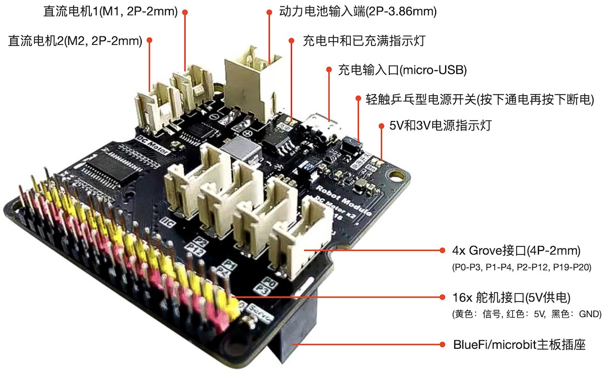
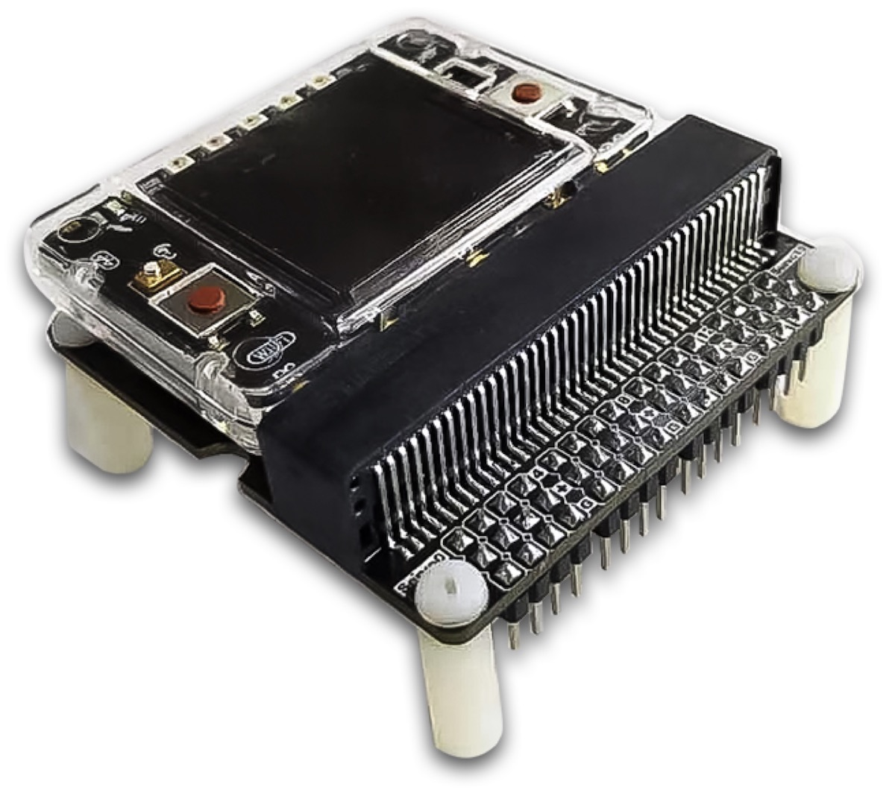

==================================
RobotModule(机器人拓展板)
==================================

RobotModule(机器人拓展板)由HiiBot推出的双直流电机和16路舵机等接口的控制板，包含以下资源：

  - 2x 直流马达控制接口，使用P13(M1IN1)、P14(M1IN2)、P15(M2IN2)和P16(M2IN1)引脚
  - 16x 舵机控制接口，使用P19(SCL)和P20(SDA)引脚(组成I2C)
  - 4x Grove接口(2mm-4P)，使用P0和P3、P1和P4、P2和P12、P19(SCL)和P20(SDA)等四对引脚
  - 1x 单节锂电池充放电管理单元，充电电流高达1A
  - 1x 可连续输出25W(5V@5A)的升压电路单元
  - 1x 轻触乒乓型电源开关(避免物理触点打火隐患)，按下通电再按下断电

-----------------------------------

RobotModule的功能接口及其分布如下图所示：

备注：
  - Grove接口适合“HY2.0mm-4P”带扣/无扣类型的插头
  - 直流马达控制接口适合“HY2.0mm-2P”带扣或无扣类型的插头 

-----------------------------------

.. Caution:: 请安全使用动力电池！

  - 本模块支持峰值功率可达35W的大功率负载，只能使用动力电池。请务必安全使用动力电池！绝对禁止将电池正负极短路！
  - 什么是动力电池？能够瞬时输出数十或数百安培电流的锂电池都属于动力电池，如电瓶车、UPS电源等使用的电池均属动力电池。由于动力电池瞬时放电能力极强，如果将电池正负极短路，很容易引起火灾或爆炸危险。
  - 本模块标配的动力电池的瞬间放电能力：12A。使用时务必注意电源线连接是可靠的(尽可能降低接触电阻以减小线路损耗)，绝对禁止将电池的正负极直接短路！

-----------------------------------

BlueFi+RobotModule组成机器人控制器，如下图所示。

与microbit+RobotModule组成的机器人控制器相比，使用BlueFi丰富的传感器你将能实现更多种机器人感知和人机交互，譬如，BlueFi的姿态传感器可以感知机器人的姿态，
使用BlueFi的声音传感器、手势和颜色识别传感器、按钮等与机器人交互，使用BlueFi的彩色像素制造绚丽多彩的光效，使用BlueFi的无线电通讯、蓝牙通讯和WiFi通讯实现手柄、Pad/电脑与机器人交互等。

----------------------------------

RobotModule的供电和开关机
----------------------------------

RobotModule是一种支持大功率负载的功能拓展板，其额定功率为25W，峰值功率高达35W，建议的供电方法是采用单节动力(锂)电池(3.7V)，
譬如HiiBot配套的达12A瞬时放电能力的锂电池包，自备的锂电池包至少能连续输出8A电流。

虽然RobotModule支持USB供电和充电，这种供电接口的主要目的是为锂电池充电(最大充电电流为1A)，或者在无负载或极小负载的情况下调试和测试程序。
标准microUSB(或称USB OTG)接口标称的稳定供电电流是2A，USB Type-C(USB3.0及以上)接口标称的稳定供电电流是5A。
但是RobotModule的最大负载能力需要达到5V@7A能力，很显然USB Type-C也无法满足这一需求。RobotModule使用microUSB接口，
无法为RobotModule的负载提供稳定电源，该接口仅用于对锂电池充电。

如果你现在感觉RobotModule的供电必需谨慎，不是随便找个锂电池就能确保RobotModule正常工作。这样的大功率设备的开机和关机是否很麻烦呢？
无须担心，RobotModule的通电和断电操作却极其简单：按下轻触乒乓型电源开关即可给你的机器人通电，再次按下该按钮即断电；“乒乓”的意思你懂得。

你或许会问，为啥把供电问题解释的十分的详细还很慎重而开关电源却又如此简化呢？如果你在某些场合看到过“电火花”，些许有点可怕的感觉。
任何使用物理触点通/断电源的大电流设备在断开电源的瞬间都有可能出现空气放电产生的“电火花”，
RobotModule内部使用安全的大功率电子开关和保护电路以刻意避免产生这种吓人的“电火花”。

RobotModule的开关机操作非常简单：只要电池或USB等外部电源已可靠连接，轻按电源开关即可给RobotModule及其负载通电，再次按下即可断电。

----------------------------------

编程控制两个直流电机
----------------------------------

如果你打算设计一种轮式移动机器人原型，RobotModule+BlueFi的组合或许是最快速的、最低成本的方案。
RobotModule提供2个直流电机控制接口用作2个动力车轮的控制，这两个接口的工作电压为5V，最大电流分别为0.8A。
使用“HY2.0mm-2P”带扣/无扣的插头和电线将直流电机连接到RobotModule的直流电机接口M1或M2上。
然后我们可以使用本示例的程序代码控制两个直流电机的转向和速度。

本示例程序的代码如下：

.. code-block::  python
  :linenos:

  import time
  from hiibot_robotmodule import RobotModule
  from hiibot_bluefi.basedio import Button
  rmb = RobotModule() # rmb是机器人拓展板的实体对象，用rmb访问该拓展板上的所有接口
  btn = Button() # btn是BlueFi的A和B按钮的实体对象, 用btn访问两个按钮的接口

  rdir = 0    # 正转
  speed = 50  # 20%的转速
  rmb.motor1(rdir, speed) # 设置直流马达1的转向和速度: 正转且20%速度
  rmb.motor2(rdir, speed) # 设置直流马达2的转向和速度: 正转且20%速度

  while True:
      btn.Update() # 每一个循环都更新一次A和B按钮的状态
      if btn.A_wasPressed and btn.B_wasPressed :
          # 当两个按钮同时按下, 改变两个直流马达的旋转方向，但保持原速度不变
          rmb.motorStop()  # 换向前先停止两个马达
          if rdir==0 :
              rdir = 1
              print('Inverse rotation')
          else :
              rdir = 0
              print('Positive rotation')
          rmb.motor1(rdir, speed) # 更新直流马达1
          rmb.motor2(rdir, speed) # 更新直流马达2
      elif btn.A_wasPressed :
          speed += 25  # 转速增加10%
          if speed>255 :
              speed = 255  # 限制最大转速的值为255
          print('Speed: {}'.format(speed))
          rmb.motor1(rdir, speed) # 更新直流马达1
          rmb.motor2(rdir, speed) # 更新直流马达2
      elif btn.B_wasPressed :
          speed -= 25  # 转速减小10%
          if speed<0 :
              speed = 0  # 限制最小转速的值为0
          print('Speed: {}'.format(speed))
          rmb.motor1(rdir, speed) # 更新直流马达1
          rmb.motor2(rdir, speed) # 更新直流马达2
      time.sleep(0.01)

将本示例程序保存到BlueFi的/CIRCUITPY/code.py文件中，并将BlueFi插入到RobotModule拓展板，打开RobotModule拓展板的电源，
等待我们的程序正式开始运行后，尝试按下A按钮增加两个马达的速度、按下B按钮减小速度，同时按下A和B按钮可以改变两个马达的转向。
每次改变电机的转向或速度后请观察电机状态的变化是否达到预期。此外，在不同的转速情况下增加电机的负载并观察电机转速与负载大小之间的关系。

经过测试、观察和试验之后，我们再回来了解本示例代码，你将会觉得这些代码很好理解。前3行代码分别导入3个库模块：time、RobotModule类和BlueFi的Button子类；
后续的2行代码分别实例化RobotModule类和BlueFi的Button子类为rmb和btn两个对象；第7行和第8行代码分别定义两个全局变量：rdir和speed用于存储两个马达的转向和速度。
请注意这两个具有特定意义的变量的有效值范围，参见本向导最后一个部分的RobotModule类接口说明；第9行和第10行代码分别设置两个马达的初始转向和速度。

经过试验和观察后，我们很容易理解本示例程序的无穷循环部分的代码和逻辑：每个循环首先更新BlueFi的A和B两个按钮的状态(第13行代码)；
然后判断是否侦测到A和B两个按钮同时被按下，如果是则改变rdir变量的值，并更新两个电机的转向(但保持速度不变)；
如果A和B两个按钮未被同时按下则判断是否是A按钮被按下，如果是则增加speed变量的值，并更新两个电机的速度(保持转向不变)；
如果A按钮未被按下则判断是否是B按钮被按下，如果是则减小speed变量的值，并更新两个电机的速度(保持转向不变)。
虽然无穷循环的程序代码看起来比较长，根据试验和观察的结果来理解其中的“if .. elif .. elif .. ”逻辑就很容易。

通过本示例，我们初步掌握BlueFi+RobotModule控制两个直流马达的转向和速度，如果我们将两个直流马达安装到轮式移动机器人的底盘上，
两个马达分别作为两个车轮的动力，我们可以通过控制两个车轮的转向和速度即可控制轮式移动机器人的前进、后退、左转或右转(转弯时两个车轮存在一定的速度差)。

----------------------------------

编程控制16个舵机
----------------------------------

标准的模拟接口型舵机接口使用3根线：舵机电源+、舵机电源地和舵机角度控制(PMW)信号。控制舵机的PWM信号频率一般保持50Hz左右，该参数由舵机的机电参数决定。
虽然我们的RobotModule类接口提供PWM信号频率的属性值读和写操作接口，建议用户使用默认的50Hz。因此，舵机Servo的控制接口就非常简单，
编程时只需要指定舵机编号(有效值为0~15)和舵机的角度。需要注意的是，市面上绝大多数舵机的角度范围是0～180度，也有少数舵机的角度更大，
譬如-45~225度(总的运动角度为270度)和0~360度等。

进入本示例之前，建议你找来标准舵机(0～180度范围)，舵机工作电压范围5~6V，并将舵机的3个信号线与RobotModule的舵机接口正确地连接。
标准舵机的3个信号线的颜色分别为：黑色(电源地)、红色(电源+)、黄色(控制信号)，RobotModule的16路舵机的每一路插针的塑壳颜色正好与标准舵机的信号线颜色保持一致。
换句话说，我们只需要确定正确的插入方向即可将舵机与RobotModule的舵机接口连接。

为了简化示例代码，本示例只需要使用一个标准舵机与第0路舵机接口连接即可。

本示例程序的代码如下：

.. code-block::  python
  :linenos:

  import time
  from hiibot_robotmodule import RobotModule
  from hiibot_bluefi.basedio import Button
  rmb = RobotModule() # rmb是机器人拓展板的实体对象，用rmb访问该拓展板上的所有接口
  btn = Button() # btn是BlueFi的A和B按钮的实体对象, 用btn访问两个按钮的接口
  nServo = 0

  # 定义一个函数控制Servo缓慢旋转避免无穷大加速度引起的机械冲击
  def updatePosition(ch, stPosi, edPosi):
      setpTime = 0.002  # 1degree/2ms (0.72s/round, i.e. 83RPM)
      dir = 1 if edPosi>stPosi else 0 # direction
      diffPosi = 1 + abs(edPosi-stPosi)
      for i in range(diffPosi):
          if dir==1:
              rmb.Servo(ch, stPosi+i)
          else:
              rmb.Servo(ch, stPosi-i)
          time.sleep(setpTime)

  rmb.Servo(nServo, 10)  # 默认的初始角度是10度(尽量避免0~10度的边界角度)
  print('10 Degree')
  while True:
      btn.Update()  # 更新BlueFi的A和B按钮的状态。注意：没有该语句，按钮将不会响应
      if btn.A_wasPressed:
          updatePosition(nServo, 10, 170) # 从10度旋转到170度
          print('170 Degree')
      if btn.B_wasPressed:
          updatePosition(nServo, 170, 10) # 从170度旋转到10度
          print('10 Degree')
      time.sleep(0.01)

将本示例程序保存到BlueFi的/CIRCUITPY/code.py文件中，并将BlueFi插入到RobotModule拓展板，打开RobotModule拓展板的电源，
等待我们的程序正式开始运行后，0号舵机将旋转至10度位置，然后尝试按下A按钮让0号舵机旋转到170度位置，按下B按钮让0号舵机旋转10度位置。
反复按下A按钮和B按钮，我们将会发现0号舵机在10度到170度之间往复旋转。无论0号舵机停留那个角度，你可以用手扳动0号舵机的输出轴的位置，
尝试改变0号舵机的当前角度，并观察舵机的动作。

标准舵机是一种采用模拟接口的带有位置反馈的闭环直流电机控制元件，任何外部因素造成其设定位置与实际位置存在偏差时舵机将会自动返回设定位置。
舵机是一种典型的闭环机电控制系统，其内部采用滑环电位器测定实际位置(绝对角度)，当外力造成舵机的实际位置与设定位置之间存在偏差时，
舵机的闭环控制系统将会增加电机的输出扭矩尝试返回设定的位置，这一闭环控制行为在舵机上电起始终保持。当外力(即舵机的负载)大于舵机的最大扭矩时，
或舵机达到其工作边界时，舵机的闭环控制行为将会导致机械抖动，此时我们会听到刺耳的高频抖动。

本示例程序使用到RobotModule类的重要接口——rmb.Servo(ch, degree)来控制指定舵机旋转到指定角度。为了避免机械冲击，
本示例中定义updatePosition(ch, stPosi, edPosi)函数来控制指定编号ch的舵机从当前角度stPosi旋转到目标角度edPosi，
而且电机的运动速度保持83RPM(即每分钟83转)。

根据测试、观察的试验结果，我们很容易理解本示例的代码。通过本示例，我们已经初步了解微型闭环直流电机的位置控制用法，以及舵机的基本用法。
舵机是微型机器人的关机元件——关节动力控制单元，本示例给出舵机/机器人关节角度的控制接口的示例，
对于任意个关节(即可控的运动自由度)的机器人运动控制，关节角度和机器人姿态之间存在严格的数学映射关系，即机器人的运动学。
机器人的运动姿态控制相当于为关节群的角度控制。

------------------------------------

.. Important::
  **RobotModule类的机器人拓展板接口**

    - rmb (自定义的RobotModule类实例化对象)：

      - rmb = RobotModule() # "rmb"可以自定义为其他名称

    - I2C (I2C总线接口)支持的接口方法和属性包括：

      - rmb.i2cDevice(address): 将一个I2C接口设备(从设备，如TOF测距传感器)连接到RobotModule的Grove接口的I2C总线上，并返回该I2C设备的实体对象
      - rmb.writeValue(regAddr, bufBytes, numBytes, i2cd): 将字节个数为numBytes的字节数组bufBytes中的数据写入指定的I2C设备i2cd的寄存器中(寄存器的起始地址为regAddr)
      - rmb.readValue(regAddr, numBytes, i2cd): 从指定的I2C设备i2cd的起始寄存器regAddr开始连续读取numBytes个字节的数据，返回值为字节数组，数组长度为numBytes

    - Servo (16路舵机)支持的接口方法和属性包括：

      - rmb.frequency: 舵机控制器(PCA9685)输出的PWM信号频率的属性值(可读可写的)，有效值范围：24~1526(Hz)。注意：超出频率有效范围或引起意外错误。默认的频率属性为50，不建议修改该属性值
      - rmb.Servo(ch, degree): 设置指定编号的180度Servo的角度(绝对角度)。Servo编号ch的有效值为：0~15；Servo的角度degree的有效值为：0~180。注意：尽量避免靠近0度和180度的两个边界角度
      - rmb.GeekServo(ch, degree): 设置指定编号的270度Servo的角度(绝对角度)。Servo编号ch的有效值为：0~15；Servo的角度degree的有效值为：-45~225。注意：尽量避免靠近-45度和225度的两个边界角度
      - rmb.GeekServo_2KG(ch, degree): 设置指定编号的360度Servo的角度(绝对角度)。Servo编号ch的有效值为：0~15；Servo的角度degree的有效值为：0~360。注意：尽量避免靠近0度和360度的两个边界角度

    - DC-Motor (两个直流马达)支持的接口方法和属性包括：

      - rmb.motorStop(): 停止两个马达
      - rmb.motor1(dir, speed): 设置直流马达1的转向与速度，方向dir的有效值为：0(正转)和1(反转)；速度的有效值为：0(停转)~255(最大速度)
      - rmb.motor2(dir, speed): 设置直流马达2的转向与速度，方向dir的有效值为：0(正转)和1(反转)；速度的有效值为：0(停转)~255(最大速度)
      - car.motors(dm1Speed, dm2Speed): 同时设置两个马达的转向和速度，速度值大于零则正转/等于0停转/小于零则反转。参数1和2分别为两个直流电机的速度，速度有效值为：-255(最大速度反转)～-1，0(停转), 1~255(最大速度正转)
